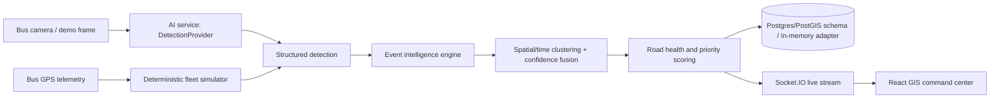

# CityFleet AI MVP architecture

## Boundaries

- `ai-service` exposes a small `/infer` contract through `DetectionProvider`. The included `DemoDetectionProvider` is deterministic and deliberately labelled as a prototype adapter, not a trained model.
- The backend's `IntelligenceEngine` owns fusion, explainable priority and road-health updates. Its current repository adapter is memory-backed for a no-setup demo; `database/schema.sql` is the matching PostgreSQL/PostGIS schema for persistence.
- The frontend subscribes to one authoritative `snapshot` Socket.IO message, keeping the map, incident rail, event evidence drawer and analytics in sync.

## Fusion method

An observation joins an active event of the same type when it occurs within 75m and eight hours. Fused confidence uses `1 − ∏(1 − wᵢcᵢ)`, where a first observation from a bus has `w=1` and a repeat pass from that same bus has `w=0.6`. Two independent buses promote an event to **confirmed**. The rounded value shown is for triage only, not a claim of calibrated model probability.

## Production replacement points

1. Replace the memory arrays with a Postgres repository using the supplied migration and a PostGIS `ST_DWithin` candidate query.
2. Replace `DemoDetectionProvider` with `LocalModelProvider` / an authenticated edge ingestion gateway.
3. Use signed evidence URLs, role-based access, audit logging, privacy retention policies and monitoring before operational use.
